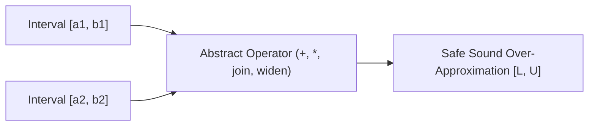

# Abstract Interpretation Interval Domain Skill

Robust, zero-dependency Python implementation of **Abstract Interpretation over the Interval Domain** for static bound checking and program verification.

## Features
- **Sound Over-Approximation**: Preserves conservative lower and upper bounds across arithmetic operations.
- **Widening Operators**: Guarantees fixed-point convergence across cyclic loop control-flow graphs.
- **Zero External Dependencies**: Pure Python standard library.
- **Native MCP Protocol**: JSON-RPC 2.0 stdio server compatible with Claude Desktop, Cursor, and Windsurf.

## Architecture

